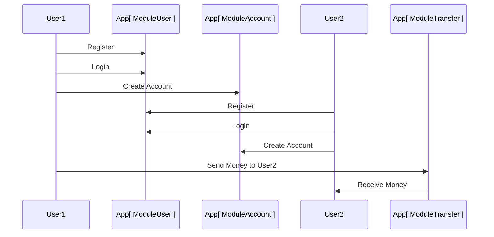
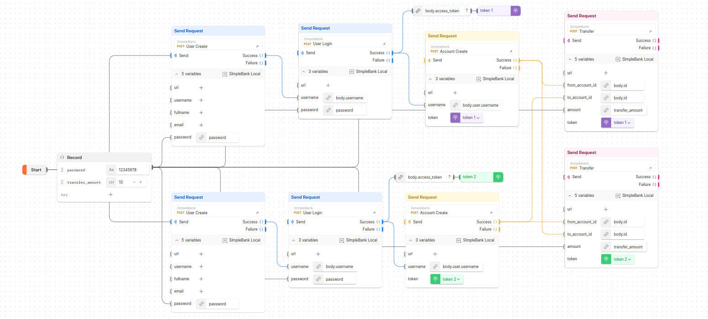
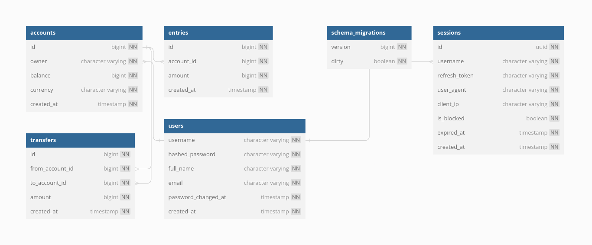

# Simplebank App
This is simplebank backend (restful-API) application using Go

This app, mostly following [TechSchool Course](https://github.com/techschool), but I modify several part of it, especially deployment part, I use minikube, cause I'm broke, can't afford to have credit card :')

Mainly the deployment using github actions

## Application Flow
Application Flow


Request Flow

[See more](https://www.postman.com/security-administrator-49084942/workspace/my-public-workspace/flow/64dda6cbefa5e00038c7afec)


## Database Schema

See more [doc](https://dbdocs.io/laba.dummy1/simplebank)

## Requirements
- [Go](https://go.dev/) language
- [go-migrate](https://github.com/golang-migrate/migrate) for migration
- [gomock](https://github.com/uber-go/mock) mocking library
- [sqlc](https://sqlc.dev/) sql query generator for Go
- [golangci-lint](https://golangci-lint.run/) linter
- [pre-commit](https://pre-commit.com/) pre commit hooks
- [Docker](https://www.docker.com/) containerization
- [Docker Compose](https://docs.docker.com/compose/) declarative config for docker
- [Minikube](https://minikube.sigs.k8s.io/docs/start/) local kubernetes deployment
- [Skaffold](https://skaffold.dev/) workflow building for kubernetes

## Run
### Run all service
```sh
$ docker compose up -d
```
### Develop
This is one of the way to develop (it can be another way)
- Start docker environment (external dependencies)
    ```sh
    $ docker compose up -d db adminer
    ```
- Start app
    ```sh
    $ go run ./main.go
    ```
    > Or using debug mode (F5) use "Run Local Server" in VSCode
- Run Automated Test
    ```
    $ go test ./...
    ```
    > Or run test via VSCode

## API Testing
Postman can be used for manual testing
- Run via [API Collection](https://www.postman.com/security-administrator-49084942/workspace/my-public-workspace/collection/28977325-d9e66c38-9472-46a8-b41c-16cf3b02a912?action=share&creator=28977325&active-environment=28977325-6493092b-46e6-4de5-a4c2-d7a72add3afe)
- Or run E2E API test via [Postman Flow](https://www.postman.com/security-administrator-49084942/workspace/my-public-workspace/flow/64dda6cbefa5e00038c7afec)
